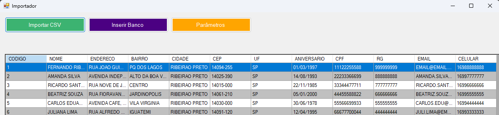
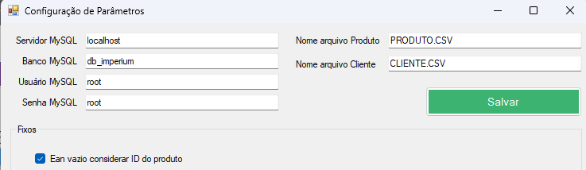

# Importador Baratela

Ferramenta desktop desenvolvida em Windows Forms para migração de dados entre arquivos .CSV e banco de dados relacional (MySQL).

## 📋 Sobre o Projeto

O Importador Baratela foi desenvolvido para simplificar processos de migração de dados entre dois ERPs, oferecendo uma interface gráfica para execução das importações.

### Principais Recursos

- Importação de dados de CSV para MySQL.
- Mapeamento de tabelas.
- Validação dos dados.
- Registro de erros e inconsistências durante o processo.

## 🛠️ Tecnologias Utilizadas

- C#
- Windows Forms
- .NET Framework 4.8
- MySQL

## 📦 Requisitos

### Sistema Operacional

- Windows 7 ou superior

### Framework

- .NET Framework 4.8

### Bancos de Dados Suportados

#### Destino
- MySQL

## ⚙️ Configuração

### MySQL

Informar:

- Host
- Banco de dados
- Usuário
- Senha

## 🚀 Como Utilizar

1. Abra a aplicação.
2. Configure a conexão de destino (MySQL).
3. Valide os dados importados.
4. Inicie o processo de migração.

## 🔄 Fluxo de Importação

```text
CSV --> MySQL
```

## 📂 Estrutura do Projeto

```text
ImportadorBaratela/
│
├── Enums/
│
├── Formularios/
│
├── Helpers/
│
├── Models/
│   ├── Config/
│   ├── Tabelas/
│
├── Services/
│
└── Program.cs
```

## 📸 Interface

### Tela Principal



### Configuração de Conexão



## ⚠️ Observações

- Recomenda-se realizar backup dos bancos antes de executar importações.
- Os nomes das colunas em ambos os arquivos (Produtos e Clientes) foram mapeadas baseadas em impotações anteriores.
- O arquivo de Produtos tem um layout de colunas mapeado, caso não esteja no layout serão considerados os nomes das colunas.
- O arquivo de Clientes é importado pelo nome das colunas.

## 🧪 Testes

Realizar testes de importação com:

- Pequenos volumes de dados.
- Campos nulos.
- Caracteres especiais e acentuação.

## 👨‍💻 Autor

Fernando Ribeiro
